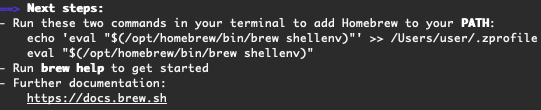

### 개발환경 설정

- 개발환경 
    - Macbook Pro
    - OS : macOS Monterey version 12.0.1

- Homebrew
    - (주로 개발자가 필요한) 프로그램을 편하게 설치할 수 있도록 도와주는 Installer 
    - 사용자가 필요한 프로그램을 손쉽게 검색할 수 있고, 기기에 설치하는 것을 도와주는 앱스토어와 유사한
    기능을 제공한다
    - Homebrew 홈페이지에 접속하면 나오는 아래 경로를 통해 설치할 수 있다
        ~~~shell
        $ /bin/bash -c "$(curl -fsSL https://raw.githubusercontent.com/Homebrew/install/HEAD/install.sh)"
        ~~~
    - Xcode Command Line Tools(CLT)가 설치되어 있지 않은 상태이면, 아래와 같이 자동으로 함께 설치해준다 
        - Xcode Command Line Tools(CLT) : git 등 맥 터미널에서 많이 사용하는 툴 등이 포함된 패키지
          
          
    - 📍Apple Silicon이 탑재된 맥북의 경우, 설치가 완료된 후에 아래와 같은 메세지가 뜬다. Homebrew 3.0.0 버전으로 오면서 
      설치되는 경로가 달라져서 그렇다. `$ PATH`  에 Homebrew 경로를 입력하는 단계인 듯 하다.  
      
      
- JDK 
    - 개인적인 용도로 개발하는 거라면 어떤 버전을 설치해도 상관없다
    - OpenJDK를 설치할 예정이며, 설치 방법은 여러가지가 있지만 brew를 이용했다
        ```shell
        $ brew tap homebrew/cask-versions
        $ brew install --cask temurin8
        ```
        - `tap` 명령어 사용 시,  
    - [참고](https://torbjorn.tistory.com/m/702)
    -  `$ PATH` 경로 설정 [참고](https://hymndev.tistory.com/5)
    
- Terminal 
    - ohmyzsh 설치 
    

### 터미널 명령어
- chmod : change mode의 약자로 파일/디렉토리의 사용 권한을 변경하는 명령어 
    - 다운받은 바이너리 파일 실행하려고 하니 자꾸 permission denied 에러가 났는데, chmod를 통해 권한을 추가해주니 정상 실행됨
    ```shell
        # 파일 실행 
        $ ./실행하려던-파일 
  
        # 아래 에러메세지가 나타남 
        zsh: permission denied: ./실행하려던-파일
  
        # 아래와 같이 실행권한(x) 추가
        sudo chmod +x ./실행하려던-파일
        password : #패스워드 입력 
    ```

### 리눅스
- [인프런 리눅스 강의](operating-system/linux.md)

### 컴퓨터 구조
- [패스트캠퍼스 컴퓨터 구조 강의](computer-structure/fast-campus.md)

### 기타
- UTF-8과 MySQL의 utf8mb4 (TO-DO)

  
    
  