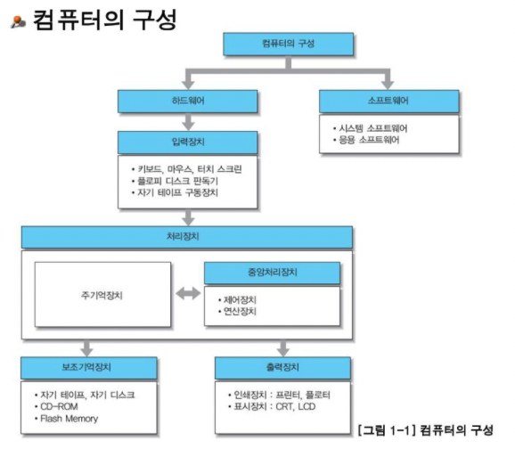

### Ch1. 컴퓨터 시스템의 이해

- 컴퓨터의 전체적인 구성 
    - 참고 : https://slidesplayer.org/slide/16465850/
    - 
    
    - 중앙처리장치(Central Processing Unit)
        - CPU 
            - Mother board, 데이터의 전달 통로가 디자인되어 있는 메인 보드
            - 실행 프로그램의 명령을 해석, 실행, 장치를 제어 
            - ALU, CU, 각종 레지스터리로 구성되어 있음 
    - 주변처리장치
        - 주기억장치
            - RAM(Random Access Memory) : 컴퓨터의 전원을 끄면 RAM에 적재되어 있던 데이터는 전부 휘발됨
            - ROM(Read Only Memory) : 전원이 꺼져도 데이터들이 날라가지 않음. 보통 BIOS가 ROM에 저장되어 있음.
        - 보조기억장치
        - 주기억장치와 보조기억장치의 관계
            1. 전원 부팅 시, CPU는 ROM에 있는 바이오스 프로그램 실행
            2. 보조기억장치로부터 RAM에 프로그램 적재(Load)
            3. CPU는 RAM으로부터 명령어와 데이터를 가지고 와서 처리 
            4. CPU는 RAM에게 실행 결과를 돌려주고, RAM은 보조기억장치에 데이터를 저장함 
