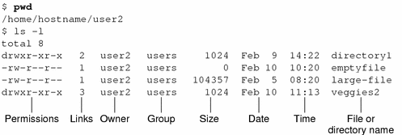

>📍 주요 참고 : 인프런 강의 [<리눅스 입문 - 개념으로 탄탄히!!>](https://www.inflearn.com/course/%EB%A6%AC%EB%88%85%EC%8A%A4-%EC%9E%85%EB%AC%B8)
---
# Chapter 1. 리눅스란 무엇인가?
## 리눅스
- 리눅스는 1991년 리누스 토르발즈(Linus Torvalds)가 개발한 운영체제
- 다양한 배포판(distro)를 가지고 있음 (ex. Ubuntu, Centos, Suse, Fedora, Mint 등)
    - 배포판 간의 공통점 : 리눅스 커널과 GNU Software 사용
    - 배포판 간의 차이점 : 기본 파일 시스템, 패키지 매니저 등 세부 구성요소들이 다름
    
## 운영체제
- 하드웨어(CPU, Memory,  HDD, GPU 등)를 사용할 수 있게 해주는 소프트웨어 프로그램
- 우리가 컴퓨터를 사용하는 목적은 운영체제 그 자체보다는 엑셀, 브라우저 등 운영체제 
그 위에서 돌아가는 프로그램들 → 운영체제는 각종 어플리케이션들이 잘 실행될 수 있도록 관리해주는 역할도 수행함

### 운영체제의 주요 구성요소
1. 커널
    - 운영체제에서 가장 핵심적인 역할을 수행 
    - 프로세스 관리, 시스템 콜
2. 프로그램 실행과 멀티 태스킹
    - 운영체제가 수행하는 주요 역할
    - 여러 프로그램들을 동시에 실행시키고 문제없이 잘 동작하도록 관리
3. 인터럽트
    - 하드웨어가 OS에게 필요한 내용을 알려주는 행위 
    - ex. 랜카드가 OS에게 'ㅇㅇ데이터 들어왔어~'
    - 예전에는 전기적인 신호를 통해 OS에게 알려주었는데, 요새는 다른 형식을 이용해서 메세지를 쏘고 있음  
4. 메모리 관리
    - 컴퓨터를 구성하는 3대 요소 
        - HDD : 프로그램을 실행할 코드 저장 
        - 메모리 : 코드를 HDD로부터 읽어와서 적재함
        - CPU : 메모리로부터 코드를 가져와서 실행
    - 운영체제 입장에서는 여러 프로그램들을 관리하기 위해서는 메모리가 얼마나 남았고, 어디는 사용되고 있고 등의
    정보를 정확히 알아야 함
    - 운영체제는 실제 물리적으로 메인보드에 꽂혀있는 메모리를 자기 나름대로 재구성하여 관련된 정보를 관리하고 있음
5. 파일 시스템
    - 저장 장치에 파일단위로 데이터를 저장하게 되며, 이를 관리하는 것이 파일 시스템
    - 파일 시스템은 운영체제와 저장 장치의 중간에서 커뮤니케이션을 담당한다고 생각하면 됨
        - 운영체제는 파일 시스템에게 어떤 파일을 달라고 명령을 내리고
        - 파일 시스템은 하드 디스크를 읽어다가 운영장치에게 파일을 전달 
6. 디바이스 드라이버
    - 인터럽트와 관련 有
    - 랜카드나 GPU와 같은 하드웨어의 경우에는 꽂혀있다고 바로 작동하지는 않으며, 각각의 디바이스들이 운영체제와 협업하기 위해 디바이스 드라이버가 필요함
7. 네트워킹
8. 사용자 인터페이스

## 패키지 관리 시스템 (Package Management System)
처음 리눅스를 설치하고 이제 본격적으로 다른 소프트웨어를 사용하려고 하다보면 가장 먼저 마주하게 되는 장벽이 
패키지 관리 시스템이다. 일반적인 사용환경에서는 클릭 몇 번으로 필요한 프로그램을 다운로드/설치할 수 있지만,
리눅스 환경에서는 패키지 관리 시스템을 사용해야 하기 때문. 

### 기본구조
리눅스의 배포판마다 기본적으로 설치되어 있는 패키지 관리 시스템은 조금씩 다르다. apt, yum, rpm 등이 대표적인데, 
기본 구조는 비슷하다. 리눅스에서 패키지 매니저를 통해 어떤 소프트웨어를 요청하면, 패키지 매니저는 인터넷을 통해
해당 소프트웨어가 있는지 찾아보고 전달해준다.


### 패키지 간 의존성
패키지 관리자를 사용하는 입장에서는 전혀 신경쓰지 않아도 되는 부분이기는 하지만, 
하나의 패키지를 설치한다는 건 생각보다도 훨씬 어렵고 복잡한 일이다. 단독으로 작동되는 패키지면
상관이 없지만, 다른 패키지에 의존성을 가지는 패키지를 설치하다 보면 관련된 패키지 A, 패키지 B, 패키지 C 등을
설치하게 되고 문제없이 다 작동되도록 순서대로 설치해야 하기 때문. 

>✏️ apt 패키지 매니저
>
> 패키지 매니징해주는 프로그램은 apt 외에도 yum(CentOS)나 brew(주로 Mac OS) 등이 있지만, Ubuntu에서는 apt이 대표적.

---
# Chapter 2. 기본 쉘 명령어
## 쉘(Shell)이란?

사용자가 리눅스의 하드웨어+운영체제(정확히는 커널)에 접근하기 위해 
사용하는 프로그램. 
즉, 사용자와 커널간의 대화를 중개하는 일종의 인터페이스. 
>✏️ 커널과 운영체제의 차이?
> 
> 메모리에 상주하는 운영체제의 부분을 커널이라고 한다. 운영체제도 하나의 소프트웨어
> 이기 때문에, 실행되기 위해서는 컴퓨터가 켜짐과 동시에 메모리에 운영체제가 
> 올라가있어야 한다. 하지만 운영체제는 규모가 아주 큰 프로그램이기  때문에 
> 모두 메모리에 올라가 있게 된다면 메모리의 낭비가 크게 될 것.
> 따라서 반드시 항상 필요한 부분만을 메모리에 상주시키게 되는데, 
> 이때 그 **반드시 항상 필요한 부분**을 <U>커널</U>이라고 일컫는다

### 쉘의 종류
쉘의 종류는 무수히 많지만, 리눅스의 디폴트 값은 bash 쉘이다. 
- bash (Bourne Again Shell)
- zsh (Catalina OS부터 맥의 default shell)
- csh

>✏️️ Q1. 쉘 프로그램은 왜 여러 개가 있을까? 
> 
> 조금은 뻔한 이유지만, because people have different needs and it's good to have
> alternatives fitting your needs in the given situation ([참고](https://unix.stackexchange.com/questions/57105/why-there-are-multiple-shells-in-a-unix-like-system/57110))
> 
>✏️ Q2.쉘 프로그램이 여러 개가 있다면 내가 사용하고자 하는 쉘도 마음대로 변경할 수 있을까?
> 
> 바꿀 수 있다. 기본 브라우저를 인터넷 익스플로러로 할 것이냐 구글 크롬으로 할 것이냐
> 변경할 수 있는 것 처럼 내 마음대로 변경할 수 있다!! 


현재 디폴트로 설정되어 있는 쉘의 종류를 알고 싶다면 다음과 같은 명령어를 통해 알 수 있다.
```shell
# 참고 
# - Baeldung <Determine the Current Shell in Linux>
# https://www.baeldung.com/linux/find-current-shell

#1.
$ echo $SHELL

#2. 
$ echo $0
```

그렇다면 사용자는 어떻게 쉘을 이용할 수 있을까?

## 터미널 프로그램

리눅스를 설치하게 되면 기본적으로 터미널 프로그램도 함께 설치된다.
사용자들은 바로 이 터미널 프로그램을 통해 쉘을 이용하는 것

## 기본 쉘 명령어

### man (manual)
명령어와 관련된 상세 내용을 조회할 수 있는 백과사전 같은 명령어
```shell
# 사용법
$ man [명령어]

# 예시
$ man ls
```
참고로 조회된 페이지에서 원하는 단어를 검색하고 싶을 땐  `/[찾고자 하는 단어]`를 입력하면 된다.

### ls (list) 
현재 디렉토리에 있는 폴더/파일을 모두 보여주는 명령어
```shell
# 예시
$ ls
```

### cd (change directory)
다른 디렉토리로 이동할 때 사용하는 명령어
```shell
# 예시
$ cd Downloads # Downloads 폴더로 이동
$ cd .. # 부모 디렉토리로 이동
$ cd # 현재 어디있든지 간에 홈 디렉토리로 돌아가게 됨
```

### pwd (print working directory)
현재 내가 있는 디렉토리를 출력해주는 명령어
```shell
# 예시
$ pwd
> /Users/applemango2021/Downloads
```

### cat (concatenate)
파일의 전체 내용을 보여주는 명령.
```shell
# 예시
$ cat test.txt
```
파일명이 'd'로 시작하는 파일이 여러 개가 있는 경우, 다음과 같이 d까지만 입력하고 tab 키를 누르게 되면
d로 시작하는 파일명이 쭉 나온다.
```shell
# 예시
$ cat d #여기까지 치고 탭을 누르게 되면 아래와 같이 d로 시작하는 파일들이 나오게 된다.
> daily.log dtest.txt ddd.txt 
```
>✏️️ cat 명령어를 통해 파일의 내용을 조회할 수는 있지만, 편집할 수는 없다. 
> 파일 편집기로 많이 사용되는 프로그램으로는 vim, vi, nano 등이 있다.

### head
파일의 초반 n줄(-n 옵션을 쓰는 경우에는 라인 단위이며, 바이트 단위로도 가능함)을 보여주는 명령어
```shell
# 예시
$ head -n 20 test.txt #test.txt 파일의 초반 20줄을 보여줘라
```

### tail
파일의 하단 n줄(-n 옵션을 쓰는 경우에는 라인 단위이며, 바이트 단위로도 가능함)을 보여주는 명령
```shell
# 예시
$ tail -n 20 test.txt #test.txt 파일의 하단 20줄을 보여줘라
```

### grep (Global Regular Expression)
파일의 내용을 검색하는 명령어
```shell
# 예시
# 대소문자 구분을 무시한 채(i) test.txt에서 'hello world'를 조회해라 
$ grep -i 'hello world' test.txt
```
> ✏️️ 파이프(|) 명령어
> 
> 명령어가 수행되는 과정은 "입력 - 실행 - 출력" 3단계로 구분할 수 있다. 이때 파이프(|) 명령어를
> 사용하여 여러 개의 명령어를 함께 묶어서 사용하면, 앞의 명령어의 출력 결과를 뒤의 명령어의 입력으로
> 전달해주는 것이라고 생각하면 된다. 
> 아래의 경우에는 'test.txt 파일을 보여주는데, 대신 hello world 문구만 보여줘'가 되는 것.
>> $ cat test.txt | grep 'hello world'

### find 
파일을 조회할 수 있는 명령어. 조회 이외에도 삭제를 할 수 있기 때문에 옵션 사용시 주의해야 함.
조회 시, 기본적으로 현재 디렉토리를 포함한 하위 디렉토리를 모두 조회한다. 
```shell
# 예시
# 현재&하위 디렉토리 중에서 파일명이 'conf'로 끝나는 파일을 모두 찾아라
/etc $ find -name "*.conf" -print

# 아래 명령어의 조합은 상세한 메카니즘은 달라도 사실상 위와 동일한 결과를 보여준다. 
/etc $ find | grep "conf"
```

### gzip (GNU zip)
파일을 압축하는 명령어 (확장자는 .gz가 된다)
```shell
# 예시
$ gzip filelist #성공적으로 실행 시 filelist.gz이라는 파일이 생성됨

# 아래 명령어를 통해 filelist.gz의 정보를 확인할 수 있음
$ file filelist.gz
> filelist.gz: gzip compressed data, was "filelist", (후략)
```

### gunzip (GNU unzip)
gzip 파일을 압축해제 하는 명령어
```shell
# 예시
$ gunzip filelist.gz
```

### tar (Tape Archive)
tar 명령어 자체는 여러 개의 파일을 하나로 묶어주는 것.
보통 압축/압축해제 옵션과 함께 자주 사용된다. 
```shell
# 예시 1) 압축 시
# czf : tar 파일을 만들어서 압축하고 현재 옵션 뒤에 나오는 파일로 만들것
# test.tar.gz : 새로 만들어질 tar.gz 파일
# filelist.gz & test : 묶어질 파일들 
$ tar -czf test.tar.gz filelist.gz test

# 예시 2) 압축해제 시
$ tar -xf test.tar.gz
```

### exit
현재 실행중인 *쉘*을 끝내는 명령어. 터미널을 끝내는 명령어가 아니다!
따라서 하나의 쉘(A)에서 다른 쉘(B)을 또 실행시키는 경우, B에서 exit을 실행하는 경우
B 쉘에서 빠져나와 A 쉘로 돌아가게 된다. 

### date & cal 
오늘 날짜와 달력을 보여주는 명령어 

### history
내가 입력한 명렁어 히스토리를 보여주는 명령어

---
# Chapter 3. 파일 & 파일 시스템
## 파일 시스템
파일이 잘 관리되고 구동될 수 있도록 하는 시스템. 파일 시스템은 디스크와 OS 모두에 발을 걸친 시스템이라고 
생각하면 된다. 

파일 시스템에는 종류가 여러 가지가 있는데, (리눅스 - ext2, ext3, etc.) 어떤 파일 시스템을 이용하느냐에
따라서 파일의 최대 크기 등 여러 설정값이 달라질 수 있다. 또한 미디어(하드 디스크, 플래시 메모리 등)마다 
데이터를 저장하는 방식도 다르기 때문에 파일 시스템도 그에 따라 서로 다른 특성을 가지고 있다.
어떠한 파일 시스템을 사용할 것인지는 개발자가 결정해야 할 영역.

## 리눅스에서의 파일 계층 구조
관리를 위해 트리 형태로 구성되어 있다


## 파일의 종류
|파일의 종류|설명|
|--------|---|
|일반 파일| 텍스트 파일, 동영상 파일 등|
|디렉토리 | 운영체제가 보기에는 디렉토리도 하나의 파일|
|심볼릭 링크파일|윈도우의 바로가기와 같은 개념의 파일|
|블록 디바이스 파일|블록 디바이스를 제어하기 위한 파일|
|문자 디바이스 파일|문자 디바이스를 제어하기 위한 파일|
|파이프 파일|파이프를 나타내며, 프로세스간 통신에 사용되는 파일|
|소켓|소켓을 나타내며, 프로세스간 통신에 사용되는 파일|


> ✏️️ 디바이스 파일
> 
> 하드웨어가 잘 작동하기 위해서는 OS와 연결되어 있어야 하는데, 그 연결고리의 역할을 하는 것이 OS 내의 Device Driver.
> 댜갸 디바이스 드라이버는 운영체제의 명령을 받아 하드웨어를 동작시키는 역할을 하지만, 때로는 Application 레벨의 프로그램과 
> 직접 커뮤니케이션을 할 때도 있는데 이러한 경우에 필요한 것이 디바이스 파일. 
> 애플리케이션은 디바이스 파일을 통해서 디바이스 드라이버와 통신을 하고, 이를 통해 궁극적으로는 디바이스를 제어할 수 있음.
> /dev 아래에서 디바이스 파일들을 확인할 수 있음.

## 대표적인 디렉터리
|디렉터리|설명|
|--------|---|
|/|루트 디렉터리|
|/bin| 모든 사용자가 사용할 수 있는 여러 가지 실행파일 위치. /usr/bin이 있을 수 있는데, 이 경우에는 특정 사용자가 추가한 실행파일|
|/sbin|시스템 관리자 권한으로 실행해야 하는 실행파일 위치|
|/etc|여러 가지 설정파일. 대개 일반 사용자 권한으로 변경할 수는 없고, sudo로 수정 가능. 잘 모른다면 웬만하면 건들지 않는 게 좋음|
|/lib|공유 라이브러리 디렉터리|
|/home|사용자들의 홈 디렉터리|
|/mnt|일시적으로 파일시스템에 마운트하는 경우에 사용하는 디렉터리|
|/proc, /sys|시스템 정보를 설정/조회할 수 있는 디렉터리. OS가 만들어낸 가상의 디렉토리이며, 만약 애플리케이션 단에서 proc이나 sys 아래에 있는 파일을 cat 명령어 등을 통해 조회한다면 OS에서 필요한 데이터를 알맞게 가공하여 보여줌. |
|/tmp|임시 디렉터리|
|/usr|사용자가 추가한 실행 파일, 라이브러리 등의 소프트웨어 저장|
|/dev|디바이스 드라이버가 사용하는 디바이스 파일 디렉터리|

## 디렉터리와 관련된 기본개념
- 현재 작업 디렉토리(CWD, Current Working Directory) : 터미널 프로그램에서 
$ 앞에 붙어있는 경. 명령어 'pwd'를 통해서 알 수도 있음.
- 홈 디렉토리 : 리눅스는 멀티 유저를 지원하는데, 홈을 여러 유저가 나눠쓴다고 보면 됨.
'test' 유저의 홈 디렉터리는 '/home/test'이고, 'abc' 유저의 홈 디렉터리는 '/home/abc'이다.
기본적으로 다른 유저의 데이터는 볼 수 없도록 하기 위해 영역을 나눈 것이라고 생각하면 된다. 
- 상대 경로 vs 절대 경로   
   - 절대 경로 : 루트 디렉터리를 기준으로 파일의 경로를 나타낸 것 (ex) /xyz/abc
   - 상대 경로 : 현재 작업 디렉터리를 기준으로 파일의 경로를 나타낸 것 (ex) 내가 abc에 있다면 xyz를 나타내기 위해 ../로 지칭
      - 상대경로에서 '..' 은 부모 경로를 나타내며, '.'은 현재 디렉터리를 나타냄
   

## 하드링크와 소프트링크
### 아이노드(inode)
파일을 구성하는 하나의 요소이며 파일에 대한 메타데이터가 저장되어 있는 것이라고 생각하면 됨.
- 하나의 파일 = 파일 이름 + 데이터 + 아이노드 

### 하드링크와 소프트링크
- 하드링크
   - 원본 파일의 아이노드가 하드링크 파일과 공유된다
   - 사실상 파일 이름만 다르지 원본 파일의 아이노드 & 데이터는 동일하다 
- 소프트링크 (soft link, symbolic link, symlink)
   - 일종의 윈도우 바로가기
   - 실행파일이든 텍스트파일이든 어떠한 파일의 소프트링크 파일을 만들면, 그 소프트링크 파일을 실행하면 실제 원본파일이 실행하는 것과 동일한 결과를 보여준다. 
   - 이때 소프트링크 파일의 아이노드와 원본 파일의 아이노드는 아예 다른 값을 가지고 있다. 파일의 데이터도 다르다! 대신에 소프트링크 파일의 데이터에 실제 파일의
   파일 이름이 저장되어 있음
- 이미지 참고 : [리눅스 - 링크(inode, 하드링크, 심볼릭링크)](https://www.leafcats.com/141) 

## 파일 다루기
### touch
아무것도 없는 새로운 파일을 생성하는 명령어
```shell
# 예시
$ touch hahaha #touch 다음에 파일명을 입력
```

### rm
파일을 삭제하는 명령어. 휴지통에 넣는 것과 달리 rm 명령어는 파일을 바로 완전 삭제해버리기 때문에 주의해서 사용해야 함
```shell
# 예시
$ rm hahaha
```

### vim 이용하여 파일 생성
vim 편집기를 이용해서 새로운 파일을 생성하고, 내용을 입력하려고 한다면 vim 명령어를 사용하면 된다
```shell
# 예시
$ vim hahaha #vim 다음에 파일명을 입력
```
### mv(move)
파일의 경로를 변경하는 명령어인데, 파일명을 바꾸는 것과 동일. 파일명은 사실상 경로의 일부분! 
```shell
# 예시
$ mv hahaha hahaha2 #hahaha 파일을 hahaha2로 변경한 것
```

## 디렉터리 다루기
### mkdir (make directory)
디렉터리를 생성하는 명령어
```shell
# 예시
$ mkdir testdir
```

### rmdir(remove directory) & rm -rf
디렉터리 안에 파일이 없다면 rmdir로도 삭제가 가능하지만, 내부에 하나라도 파일이 있다면 해당 명령어로는 삭제가 불가능함.
만약 디렉터리와 디렉터리 안의 모든 파일을 한번에 삭제하고 싶다면 rm -rf를 사용하면 됨. 하지만 rm -rf 사용은 주의할 것!! 
```shell
# 예시
$ rmdir testdir

# -r : remove directories and their contents recursively
# -f : force
$ rm -rf testdir
```

## 아이노드와 하드링크
### ls -i
파일의 아이노드를 보여주는 명령어 

### ln (link)
링크를 생성하는 명령어. 추가 옵션을 주지 않으면 기본적으로 하드링크를 생성한다.
```shell
# 하드 링크 생성 예시
$ ln pineapple hello #pineapple 파일의 하드 링크 파일 hello를 생성 
>
$ ls -ali #hello와 pineapple의 inode값이 동일한 것을 확인할 수 있음 
> 1649973 -rw-r--r--   2 user  staff     15  1  3 16:53 hello
> 1649973 -rw-r--r--   2 user  staff     15  1  3 16:53 pineapple

# 소프트 링크 생성 예시
$ ln -s pineapple softhello
```

> ✏️️ 원본 파일 삭제 시, 소프트 링크와 하드 링크의 차이
> 
> 원본 파일을 삭제하면 하드 링크파일의 경우, 사실 그 파일만 지워지게 된다. 원본 파일과 하드 링크 파일의 차이가 없다고 해야되나?
> 하지만 소프트 링크 파일의 경우, 소프트 링크 파일 자체는 삭제되지 않지만 ls를 통해 조회 시, 링크가 깨졌음을 알 수 있다.
> 원본 파일을 동일한 이름으로 다시 생성하면 링크는 다시 만들어진다. 원본 파일과의 링크가 그렇게 타이트하지 않고 정말 
> 파일명(경로)로만 이어져있음을 알 수 있다.
 
---
# Chapter 4. 사용자와 그룹
리눅스는 멀티 유저를 지원하는 시스템. 즉, 하나의 리눅스 서버에 대해서 유저 A와 유저 B 모두 접근할 수 있다.
이때, B 사용자로부터 A 사용자의 정보를 보호하는 메커니즘들이 필요하며, 이를 위해 사용자와 그룹이라는 개념을 활용하고 있다.  


- 하나의 리눅스 시스템에는 모든 일을 할 수 있는 관리자(root)와 그 이외의 사용자/사용자 그룹이 있다고 생각하면 된다.
- 관리자는 모든 권한을 가지고 있기 때문에 사용 시 각별히 유의해야 한다. 
- 시스템 설정은 사용자별/그룹별로 진행할 수 있다. 
- 사용자는 사람을 지칭하는 것이 아니라 **계정**을 가리킨다. 한 사람이 여러 개의 구글 계정을 가질 수 있듯이, 실제 한 명의
사람이 여러 사용자를 이용하고 있을 수도 있다.
- 이때, 사람이 사용하지 않는 계정도 있다. 프로그램에서 특정한 목적을 위해 사용자 혹은 그룹을 만들어내는 경우도 종종 있다.

## 파일의 소유권과 권한
명령어 `ls -l`를 사용하면 현재 디렉터리에 있는 파일들에 대해서 아래와 같은 항목들을 보여준다.

- Owner : 파일의 소유자
- Group : 파일의 그룹 소유자 
    - 조별과제를 생각하면 이해하기가 쉽다. 파일의 소유자는 a라고 하더라도, A조원인 b와 c도 해당 파일에 대한 권한을 가지고 있어야
    원활한 협업이 가능하다. 
- Permissions : Owner, Group, 그리고 Other(Owner도 Group 사용자도 아닌 다른 사용자)마다 가능한 권한을 표현한 것
    - 
    
## 파일의 권한 설정법
파일의 권한을 변경하는 명령어로는 `chmod`가 있다. 이때 권한을 변경하고자 하는 파일은 경로를 통해 알려주면 되지만, 
변경하고자 하는 권한 그 자체를 어떻게 표기할 것인지에 따라 8진 표기법과 의미 표기법으로 나뉜다.

- 8진 표기법
    - 
    - 필요한 설정을 숫자로 나타내는 방법  
    - 이미지 참고 : [A Unix and Linux Permissions Primer](https://danielmiessler.com/study/unixlinux_permissions/)


- 의미 표기법
    - **기존 설정**에서 추가할/제거할 권한을 나타내는 방    
    ```shell
    $ chmod [ugoa(+/-)rwx] <dir>
    # u = user, g = group, o = others, a = all
    # + = add permission, - = remove permission
    
    # 예시
    $ chmod go+rx <dir> #group과 other에게 read/execute 권한을 추가
    ```
  
## 사용자의 추가 및 삭제
### adduser
사용자를 추가하는 명령어. 비슷한 명령어로 `useradd`가 있는데, 기능은 비슷하나 사용자와의 인터랙티브 측면에서
adduser를 추천한다. 사용자 추가는 루트만이 가능하기 때문에 sudo를 활용해야 한다. 이때 그룹을 
지정하지 않으면 사용자와 동일한 이름으로 그룹이 생성된다. 
```shell
$ sudo adduser john
> 'john' 사용자를 추가 중...
> 새 그룹 'john'(1001) 추가 ...
> 새 사용자 'john'(1001)을(를) 그룹 `john`(으)로 추가 ...
> '/home/john' 홈 디렉터리를 생성하는 중...
```

### whoami
현재 사용자 계정을 확인하는 명령어
```shell
$ whoami
> john
```

### su (Switch User)
계정을 변경하는 명령어. 뒤에 특정 계정을 입력하지 않으면 root 계정으로 이동하게 된다.
```shell
# 예시
$ su - john
```

### deluser
계정을 삭제하는 명령어. 생성과 마찬가지로 sudo로 실행해주어야 한다.
```shell
# 예시
$ sudo deluser john --remove-home
> 백업/제거할 파일들을 찾는 중...
> 파일 제거 중...
> 'john' 사용자 제거 중...
```

## 그룹 생성 및 사용자 추가
### addgroup
그룹을 추가하는 명령어이며 sudo를 활용해야 한다.
```shell
# 예시
$ sudo addgroup animals 
```

### 그룹에 사용자 추가
```shell
# 예시
# pig 사용자를 animals 그룹에 추가
$ sudo adduser pig --ingroup animals
```

### 파일에 권한 변경하기 
현재 animal 그룹의 사용자인 pig 계정으로 들어와 있고, 해당 그룹의 다른 사용자들에게도 testfile에 대한 
write 권한을 주려고 할 때
```shell
# 예시
# 8진 표기법
$ chmod 664 testfile

# 의미 표기법
$ chmod g+w testfile
```

> ✏️ animal 그룹의 다른 사용자가 /home/pig에 파일을 생성하려고 할 때
> 
> 기본적으로 디렉터리들은 755 권한을 가지고 있다.
> (user: 모든 권한 / group : read+execute / other : read+execute)
> 이때, animal 그룹의 dog 사용자가 /home/pig에 새로운 파일을 생성하려고 한다면
> write 권한이 없기 때문에 파일을 생성할 수 없다. 
> 
> 하지만 pig 사용자가 /home/pig에 생성한 파일을 dog 사용자가 수정하는 것은 
 
## 스크립트 실행 
### 스크립트
순차적으로 실행되는 명령의 모음. Bash Script라고 하면, 기본 쉘에서 사용되는 명령어들의
모음이라고 생각하면 됨. 

📍아래 내용들은 기본적으로 Bash Script

### Bash Script
배시 스크립트에는 몇 가지 규칙이 있는데, 우선 첫 번째 줄은 아래와 같이 시작한다.
그 이후에는 원하는 명령어를 작성한다.
```shell
# 스크립트 파일 생성
$ vim firstscript
```
`firstscript` 파일 안에는 아래와 같이 내용을 작성한다.
```shell
#!/bin/bash

ls
pwd
whoami
```
실행 시에는 다음과 같이 치면 된다. 이때 `허가 거부`라는 메세지가 나올 수 있으며, 이런 경우에는
`chmod`를 이용해서 `execution`권한을 주면 된다. 
```shell
# 절대경로 이용해서 실행
$ /home/pig/firstscript

# 상대경로 이용해서 실행
$ ./firstscript
```
> ✏️ 다른 명령어처럼 firstscript만 치면 안 되는지?
>
> man, ls 등과 같은 명령어들이 별도의 경로지정없이도 바로 실행되는 이유는, 
> 내부적으로 실행될 때에는 쉘에서 `$PATH`의 경로들을 모두 뒤져서 해당되는 명령어들을 찾기 때문!
> 참고로 `where` 명령어를 통해서 명령어가 저장되어 있는 경로를 찾을 수 있는데, 어쨌든 firstsript가
> 속해 있는 `/home/pig` 경로는 `$PATH`에 지정되어 있지 않기 때문에
> full 경로를 알려주어야 한다.